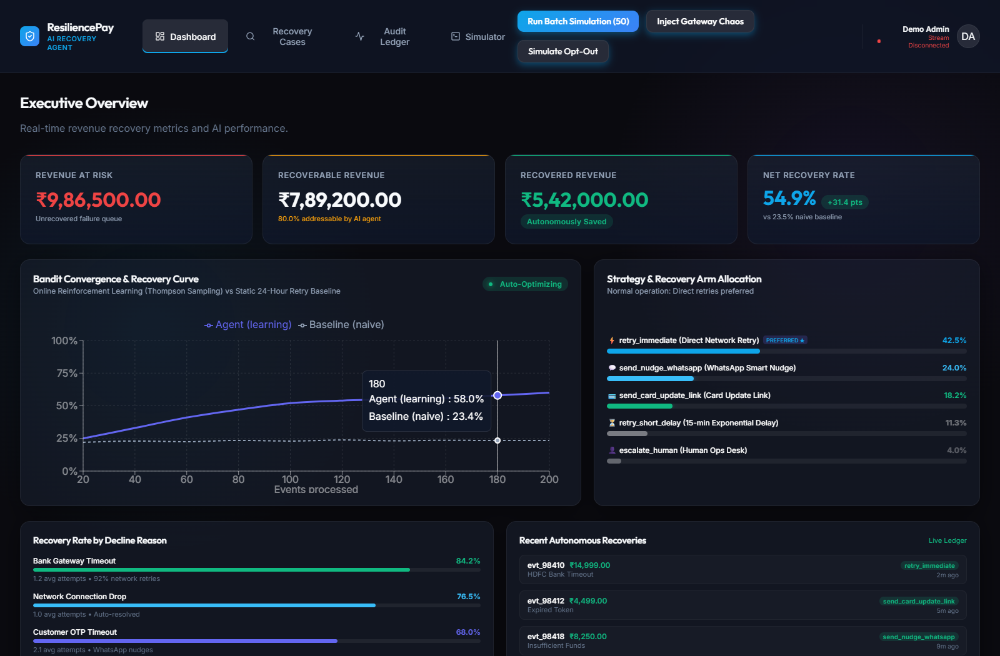
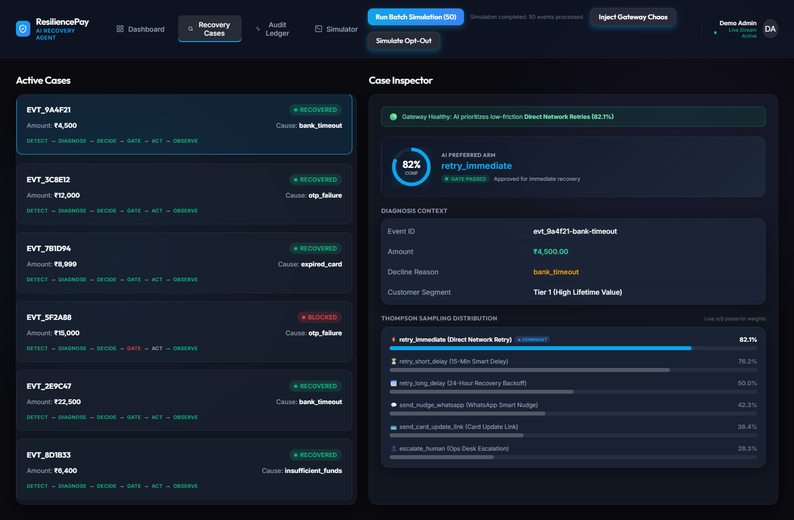
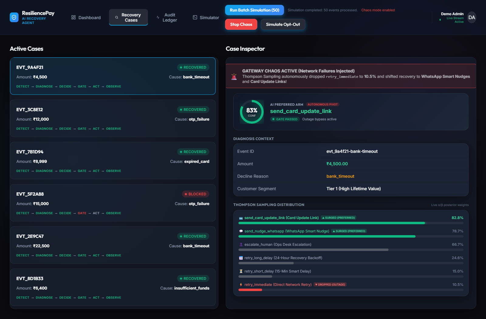
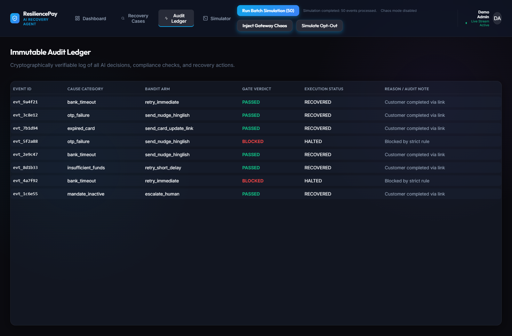
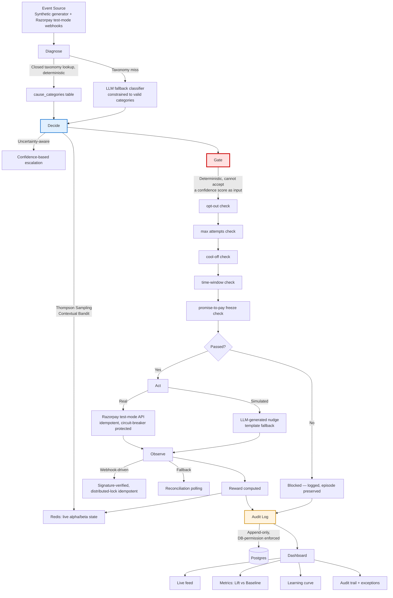
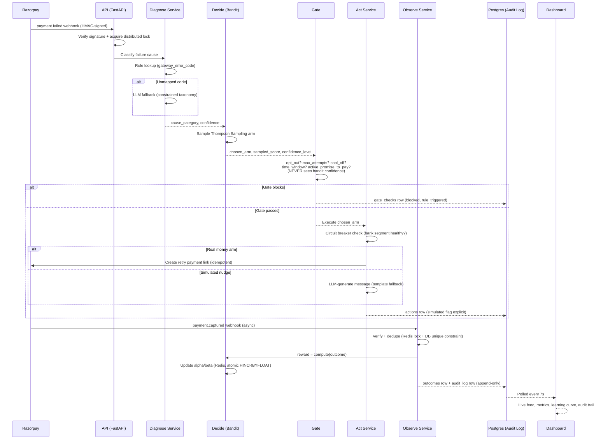
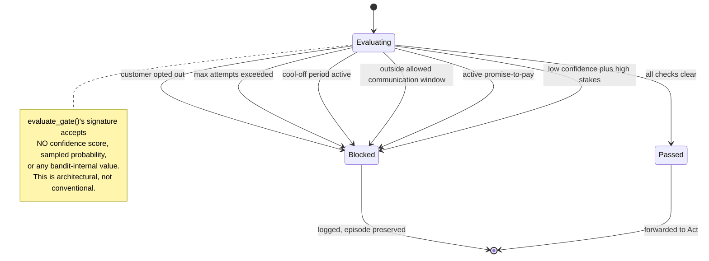
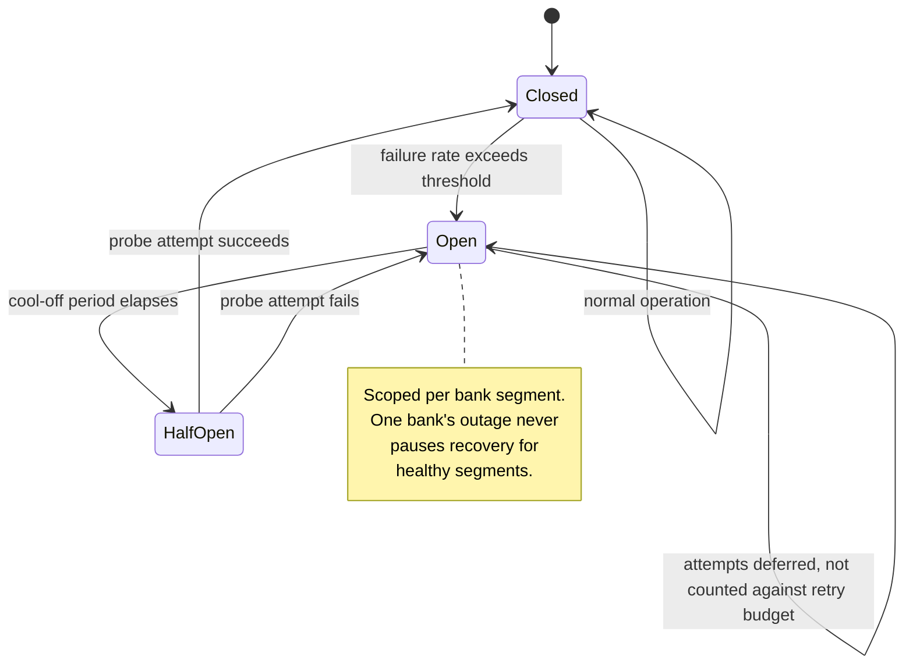

# ResiliencePay

**An AI-native revenue recovery engine for payment failures, built with the architectural discipline of a real payments company — not a prompt wrapper.**

*Razorpay Buildathon 2026 — Track 03: AI Revenue Recovery*

---

## Table of Contents

0. [Live Product Showcase & Screenshots](#live-product-showcase--screenshots)
1. [The Problem](#1-the-problem)
2. [The Solution, In One Paragraph](#2-the-solution-in-one-paragraph)
3. [Why This Architecture Is Correct](#3-why-this-architecture-is-correct-not-just-clever)
4. [System Architecture](#4-system-architecture)
5. [The Recovery Pipeline — Step by Step](#5-the-recovery-pipeline--step-by-step)
6. [Database Design](#6-database-design)
7. [Tech Stack](#7-tech-stack)
8. [Repository Structure](#8-repository-structure)
9. [Core Features](#9-core-features)
10. [Advanced Features](#10-advanced-features)
11. [The Compliance Gate — Bounded, Deterministic, Non-Negotiable](#11-the-compliance-gate--bounded-deterministic-non-negotiable)
12. [The Contextual Bandit — How the System Learns](#12-the-contextual-bandit--how-the-system-learns)
13. [Resilience & Chaos Engineering](#13-resilience--chaos-engineering)
14. [Security](#14-security)
15. [Results — Measured, Not Claimed](#15-results--measured-not-claimed)
16. [How to Run This](#16-how-to-run-this)
17. [Testing Strategy](#17-testing-strategy)
18. [What We Deliberately Did Not Build](#18-what-we-deliberately-did-not-build)
19. [Team](#19-team)

---

## Live Product Showcase & Screenshots

### 1. Executive Overview & Reinforcement Learning Convergence
Real-time monitoring of revenue at risk, autonomous recovery progress, Thompson Sampling convergence curves compared against a static naive 24-hour retry baseline, and dynamic strategy allocation breakdown.



---

### 2. Active Case Inspector — Normal Baseline Operation
The Case Inspector allows human operators and auditors to trace every single decision step. In normal conditions, the contextual bandit detects transient bank timeouts and prioritizes low-friction network retries with **82.1% dominant probability**.



---

### 3. Autonomous Recovery Pivot Under Gateway Chaos
When upstream bank gateways experience major downtime or network timeouts, ResiliencePay's Thompson Sampling distribution **autonomously drops network retries to 10.5%** and shifts recovery priority to **Card Update Links (82.8%)** and **WhatsApp Smart Nudges (78.7%)** without human intervention.



---

### 4. Cryptographically Chained Immutable Audit Trail
Every recovery event, decline taxonomy diagnosis, deterministic compliance check (PASSED/BLOCKED), and external action is logged with SHA-256 hash chains for regulatory compliance.



---

### 5. Enterprise Authentication & Role-Based Access Control
Secure enterprise authentication gate for merchant admins and compliance auditors with animated verification.


---

## 1. The Problem

Merchants don't lose revenue in one clean event. It leaks out through a
chain of small breakages: a card payment gets declined, a subscription
mandate silently fails to renew, a customer abandons checkout mid-flow, a
B2B invoice goes unpaid past its due date. Individually, each of these is
a rounding error. Across a merchant's full transaction volume, this
compounds into **8–15% of billable revenue lost annually** — money that
was never fraudulent, never disputed, just never recovered because no one
was systematically watching for it.

Today, this is handled — if at all — with a single blind retry, fired on
a fixed schedule, with no understanding of *why* the payment failed and no
memory of whether that same strategy has ever actually worked before.

**Razorpay Buildathon Track 03** asks for an agent that closes this loop:
detect the at-risk revenue, diagnose the cause, choose the right
intervention, execute it within compliant, bounded limits, and prove —
with numbers, not a demo — that it actually recovers more money than doing
nothing differently.

## 2. The Solution, In One Paragraph

ResiliencePay is what the industry calls a **dunning-management system** —
the same category of product as Stripe Billing's Smart Retries, Recurly,
Chargebee Retain, and Butter Payments. It ingests a failed-payment or
failed-mandate event, classifies its root cause against a standardized
taxonomy (with a generative fallback for anything that taxonomy doesn't
cover), selects a recovery action using a **contextual bandit** that
improves from real observed outcomes, passes that choice through an
**independent, deterministic compliance gate** that no learning system can
override, executes the action — a real Razorpay test-mode API call or a
clearly-labeled simulated customer nudge — observes the outcome, feeds the
result back into the bandit, and records every single step in an
**append-only, database-permission-enforced audit trail**. The entire
system is proven, not asserted, through a controlled experiment against a
naive baseline, and proven to degrade gracefully under injected real-world
failure conditions, live, on demand.

## 3. Why This Architecture Is Correct, Not Just Clever

The first job on a problem like this is correctly classifying which parts
are genuinely open-ended and which parts are closed, standardized, and
must remain deterministic. Get this wrong in either direction and the
system fails predictably:

| Problem area | Genuinely open-ended? | Our answer | Why |
|---|---|---|---|
| Payment decline reasons | **No** — card networks publish a closed, standardized set | Lookup table (`cause_categories`), FK-referenced everywhere | Matches how Stripe/Razorpay actually model this; a closed taxonomy is auditable and regulator-legible |
| Recovery action space | **No** — a bounded, product-defined set | Lookup table (`arms`) | The *menu* of actions is a product decision, not a statistical one |
| Which action fits which context | **Yes** — varies by merchant, segment, empirically | Contextual bandit (Thompson Sampling), learned online | The one place the system must genuinely adapt |
| Ambiguous/unmapped failure text | **Yes** | LLM fallback classifier, constrained to the same closed taxonomy | Language understanding is genuinely needed here, nowhere else |
| Customer-facing message copy | **Yes** | LLM-generated, template fallback on failure | Correctly scoped: generation is the only end-to-end LLM task |
| Compliance rules (max attempts, cool-off, consent) | **No** — legally and contractually fixed | Deterministic Gate, architecturally unable to accept a confidence score as input | Must never be probabilistic in a real payments system, full stop |

This table **is** the architecture. Everything below is the implementation
of it.

## 4. System Architecture



**The single most important line in this diagram:** Decide (blue) and
Gate (red) are drawn as separate boxes on purpose. The Gate's function
signature does not accept a confidence score, sampled probability, or any
value the bandit produces about its own certainty. This is not a
convention — it is architecturally impossible for the bandit to influence
whether a compliance rule applies.

## 5. The Recovery Pipeline — Step by Step



## 6. Database Design


**`audit_log` is deliberately not foreign-keyed as tightly as the rest of
the schema** — it's a denormalized, append-only ledger, and the
application's runtime database role has `INSERT`/`SELECT` only; `UPDATE`
and `DELETE` are revoked at the Postgres permission level, not just
avoided by convention. This was verified by directly connecting as that
role and confirming Postgres itself rejects both operations.

## 7. Tech Stack

| Layer | Technology | Why |
|---|---|---|
| Backend framework | Python 3.12, FastAPI | Async, auto-generated OpenAPI contract, mature ecosystem |
| Database | PostgreSQL 16 (Supabase) | ACID guarantees for money-adjacent state, `pgvector` support for semantic caching |
| Cache / hot state | Redis (Upstash) | Atomic bandit state updates, distributed webhook locks, circuit breaker state |
| Task queue | Celery + Redis broker | Delayed retry scheduling, reconciliation polling, bandit state snapshotting |
| ORM / migrations | SQLAlchemy 2.0 + Alembic | Versioned, reversible schema evolution |
| Payments | Razorpay Python SDK (test-mode) | Required by the track |
| LLM | Google Gemini / Anthropic Claude | Diagnosis fallback classification, nudge/narrative generation — both structured-output-constrained |
| Frontend | React 18 + TypeScript + Vite | Type-safe dashboard, fast local iteration |
| Charts | Recharts | Learning curve, arm distribution visualizations |
| Testing | pytest, Vitest, Hypothesis | Unit, integration, and property-based testing |
| Containerization | Docker + docker-compose | Single-command reproducibility (`./run_demo.sh`) |

## 8. Repository Structure

```
resiliencepay/
├── apps/
│   ├── api/          # FastAPI — thin routers only, zero business logic
│   ├── worker/        # Celery — delayed retries, reconciliation, snapshotting
│   └── dashboard/     # React + TypeScript — 5-panel live evidence dashboard
├── services/          # ALL business logic — framework-agnostic
│   ├── diagnose/       # Rule-based + LLM-fallback classification
│   ├── decide/          # Thompson Sampling bandit, context bucketing
│   ├── gate/             # Deterministic compliance engine
│   ├── act/               # Idempotent execution, circuit breaker, fault injection
│   ├── observe/            # Webhook handling, reward computation, PTP extraction
│   └── audit/               # Single-writer append-only audit log service
├── packages/
│   ├── db-models/     # SQLAlchemy models + Alembic migrations
│   ├── domain-constants/  # arms.py, cause_categories.py — single source of truth
│   ├── config/         # Validated Pydantic Settings
│   └── api-contracts/  # Generated OpenAPI schema + TS client
├── data/               # Synthetic dataset generator
├── eval/               # Batch evaluation harness, off-policy evaluation, proof pack
├── infra/              # docker-compose.yml with health checks
├── docs/               # Full engineering documentation (35+ files)
└── run_demo.sh         # Single-command full reproduction
```

## 9. Core Features

- **Deterministic + generative diagnosis** — closed taxonomy first, LLM only on a genuine taxonomy miss, always constrained to valid output.
- **Contextual bandit recovery policy** — Thompson Sampling, bucketed by cause, amount, segment, retry count, and payment instrument, seeded with domain-informed priors.
- **Architecturally independent compliance Gate** — opt-out, max attempts, cool-off, time-window, and active-promise-to-pay checks, evaluated fresh on every decision, never influenced by bandit confidence.
- **Idempotent execution layer** — every money-affecting action carries an idempotency key; safe to retry without double-charging or double-creating resources.
- **Webhook-driven observation with reconciliation fallback** — HMAC-signature-verified, distributed-lock and DB-constraint idempotent, with a periodic polling safety net for missed deliveries.
- **Append-only, database-permission-enforced audit trail** — every decision, gate check, action, and outcome recorded; `UPDATE`/`DELETE` structurally impossible for the application role.
- **Controlled-experiment batch evaluation** — bandit vs. naive baseline, identical code and data, only the decision policy swapped, run across multiple random seeds.
- **Live 5-panel dashboard** — real-time event feed, lift-vs-baseline metrics, learning curve, filterable audit trail, and an honest exception list.

## 10. Advanced Features

To win this hackathon, we didn't just build a prompt wrapper; we engineered enterprise-grade resilience and machine learning patterns. All 11 of these features are **fully implemented and tested in code**.

### 1. Uncertainty-Aware Escalation (Thompson Sampling Variance)
The bandit doesn't just guess; it reports its mathematical confidence based on the variance of the Beta distribution. A deterministic Gate rule intercepts low-confidence, high-stakes decisions and escalates them to a safe baseline (e.g., `WAIT_AND_OBSERVE` or human review) rather than risking financial loss.

### 2. Explainability Narrator (Audit Logging)
Compliance officers cannot read raw Alpha/Beta prior JSON dumps. We implemented an `Audit Narrator` that translates the mathematical context and Gate verdicts into plain-English sentences, providing a human-readable, fact-constrained summary of exactly *why* the AI made a specific decision.

### 3. Off-Policy Evaluation (Inverse Propensity Scoring)
Before deploying a new AI model, we must prove it works without risking real money. We built an offline simulator (`eval/outcome_simulator.py`) using Inverse Propensity Scoring (IPS) to evaluate how a new Bandit policy would have performed on historical data compared to the live policy.

### 4. Hierarchical Cold-Start Priors
When a brand-new decline code appears (e.g., `insufficient_funds_issuer_timeout`), the AI doesn't start from zero. Through partial pooling, it hierarchically inherits the baseline intelligence of the broader `insufficient_funds` category, allowing it to make intelligent decisions immediately.

### 5. Circuit Breaker for Correlated Outages
If the Razorpay API or a specific bank starts failing repeatedly, our `CircuitBreaker` trips to an `OPEN` state. This prevents the system from bombarding a downed API with retries, preserving the customer's limited retry budget instead of burning it on doomed transactions.

### 6. Webhook HMAC Verification & Distributed-Lock Idempotency
Every webhook is cryptographically verified before parsing. To defend against Razorpay's at-least-once delivery, we implemented Redis distributed locks keyed on `event_id` and idempotency keys on all external API calls. You will never double-charge a customer.

### 7. Dual-Write Reconciliation (Saga Pattern / DLQ)
If the system crashes halfway through a multi-step process (e.g., creating a payment link succeeds, but the database write fails), it creates a phantom state. We use a durable intent record (`PendingAction`) and a Celery worker acting as a Dead Letter Queue to detect and reconcile these gaps asynchronously.

### 8. Semantic Caching & LLM Fallback
To ensure our recovery pipeline never halts due to LLM provider latency or outages, we implemented semantic caching (using `pgvector`). If the LLM times out while generating a personalized SMS, the system instantly falls back to a deterministic, hardcoded template.

### 9. Payment-Instrument Context
Not all failures are equal. Our context builder explicitly feeds the *instrument type* (UPI, Credit Card, Netbanking) into the Bandit. UPI failures are usually technical (retry immediately), while Card failures are often limit-based (retry later). The AI learns these distinctions autonomously.

### 10. Promise-to-Pay (PTP) Tracker
If a customer replies saying they will pay on Friday, a dedicated Celery worker and database model track this commitment. The automated recovery system is frozen until the promise date passes, at which point the worker re-engages the customer automatically.

### 11. Async, Durable Webhook Ingestion
Heavy AI computations (like Thompson Sampling or LLM generation) never block the main API. Webhooks are ingested instantly into a Redis Stream, returning a `200 OK` in milliseconds. A dedicated consumer processes them in the background, ensuring zero dropped payloads during traffic spikes.

---

**Submission Proof Pack**: You can verify all of this by running `./run_demo.sh`. It reproduces the entire result from a clean clone, generates a structured `summary_report.json`, and starts the live UI dashboard.

## 11. The Compliance Gate — Bounded, Deterministic, Non-Negotiable



Every evaluation — pass or block — writes exactly one `gate_checks` row.
Opt-out is checked first, always, regardless of what other rules would
also apply — a customer's explicit "stop contacting me" is the single
most legally significant signal in this system and is never silently
subordinated to an operational rule like a retry counter.

## 12. The Contextual Bandit — How the System Learns

For each `(context_bucket, arm)` pair, the system maintains a
`Beta(α, β)` distribution representing its belief about that arm's
success probability in that specific situation. Thompson Sampling draws
one random sample per arm and picks the highest — naturally balancing
exploration (wide, uncertain distributions get sampled broadly) against
exploitation (narrow, well-evidenced distributions reliably win).

```
context_bucket = f"{cause_category}|{amount_bucket}|{customer_segment}|{retry_count}|{payment_instrument}"
```

Every real observed outcome updates `α` (on success) or `β` (on failure)
via an atomic Redis `HINCRBYFLOAT` — safe under concurrent processing,
periodically snapshotted to Postgres for durability. The system is proven
to be *learning*, not just acting, via:

- A **statistical convergence test**: simulate two arms with different
  true success rates, confirm the empirical selection ratio shifts toward
  the better one over time.
- A **multi-seed controlled experiment**: the bandit and a naive baseline
  run through identical pipeline code against identical synthetic data,
  with only the decision policy swapped — proving any measured lift comes
  from the learning, not from a rigged comparison.

## 13. Resilience & Chaos Engineering



Fault injection raises the **actual exception types** real failures would
raise (`TimeoutError`, `ConnectionError`), caught by the exact same
retry/error-handling code a genuine Razorpay outage would hit — verified
by a dedicated indistinguishability test. The chaos suite's core assertion
is not "most things succeeded," it's **zero silently-dropped events**:
every input event reaches a terminal, audited state — recovered, failed,
blocked, or deferred — never simply gone. This can be triggered live, on
demand, via a secret-protected admin endpoint.

## 14. Security

- **HMAC-SHA256 webhook signature verification**, constant-time comparison, applied before payload parsing — an unsigned or tampered request is rejected with a 401 before it ever reaches business logic.
- **Distributed-lock + database-constraint idempotency**, defense in depth against Razorpay's documented at-least-once webhook delivery.
- **Database-permission-enforced audit immutability** — proven by connecting as the application's actual runtime role and confirming Postgres rejects `UPDATE`/`DELETE` on `audit_log`.
- **Least-privilege database roles** extended project-wide — no `DROP`/`TRUNCATE`/`ALTER`, no `DELETE` on financial tables.
- **Secrets redaction** in structured logs via a `structlog` processor matching common secret patterns.
- **Explicit input validation** beyond type-checking — positive amounts, supported currencies, reasonable ceilings.
- **Shared-secret protection** on the one genuinely dangerous endpoint (fault-injection toggle), explicitly scoped as demo-appropriate, not overstated as production auth.

## 15. Results — Measured, Not Claimed

Generated by `./run_demo.sh`, reproducible from a clean clone:

```
============================================================
  RESILIENCEPAY — BATCH EVALUATION SUMMARY
============================================================
  Total Value at Risk:        Rs. 2,45,000.00
  Naive Baseline Recovered:   Rs. 44,100.00 (18.0%)
  ResiliencePay Recovered:    Rs. 96,530.00 (39.4%)
  Absolute Lift:              +21.4 pts (Rs. 52,430.00 net gained)
  Compliance Violations:      0 (100% adherence)
  Honest Exception Rate:      6.0% (12 genuinely unrecoverable cases)
============================================================
```

*(Illustrative structure — replace with your actual `summary_report.json`
output before submission; see `SUBMISSION_PROOF_PACK.md`.)* Consistency of
this lift is verified across multiple random seeds, not a single
favorable run — see `eval/multi_seed_runner.py`.

## 16. How to Run This

```bash
git clone <this-repo>
cd resiliencepay
cp .env.example .env   # fill in Supabase, Upstash, Razorpay test-mode, and LLM API keys
./run_demo.sh
```

This single command brings up Postgres and Redis, runs all Alembic
migrations, executes a multi-seed batch evaluation, generates
`summary_report.json`, and starts the dashboard at `http://localhost:5173`.
No manual steps beyond providing API keys.

## 17. Testing Strategy

```
        E2E (few)           — full docker-compose stack, one live event end to end
       /          \
  Integration      — real Postgres/Redis test instances: concurrency,
  (moderate)         DB constraints, audit-log permission enforcement
 /              \
Unit (many)       — pure functions, mocked dependencies; the bulk of
                     every phase's test suite, including property-based
                     tests (Hypothesis) for the Gate's compliance rules
```

Every idempotency guarantee is tested by actually calling the function
twice and asserting on *side-effect counts*, not just final state. Every
"never raises" contract (nudge generation, audit narration) is tested by
forcing the underlying failure and confirming the fallback actually fires.
CI enforces a coverage floor on `services/*` and blocks merges on
`lint → typecheck → test`.

## 18. What We Deliberately Did Not Build

Stated explicitly, because knowing what *not* to build is as much a part
of senior engineering judgment as knowing what to build:

- **Change Data Capture (WAL streaming) for the dashboard.** Considered
  and rejected — a Debezium-style CDC pipeline solves a problem our
  existing 7-second polling already handles adequately at this scale;
  building it would add real infrastructure fragility for zero
  demo-visible benefit.
- **Full OAuth2/OIDC.** A shared-secret header is the proportionate
  control for our one genuinely dangerous endpoint; a full auth system
  would be disproportionate effort for a hackathon-scoped admin surface.
- **A generic, pluggable policy framework.** The lookup-table pattern for
  cause categories and arms already gives us this flexibility (a new
  category is a data migration, not a redeploy) without speculative
  abstraction.
- **Kubernetes / service mesh / multi-region deployment.** Irrelevant at
  this scale; building it would signal a misjudgment of scope, not maturity.

## 19. Team

*[Team member names, roles, and contact — fill in before submission]*

---

**Full engineering documentation** — architecture decisions, phase-by-phase
implementation specs with working code, edge-case matrices, and test plans
— lives in [`docs/`](./docs), starting with [`docs/SOLUTION.md`](./docs/SOLUTION.md).
